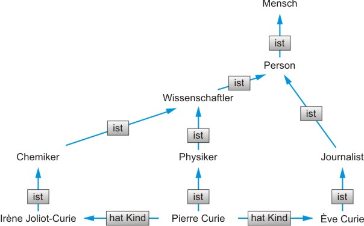
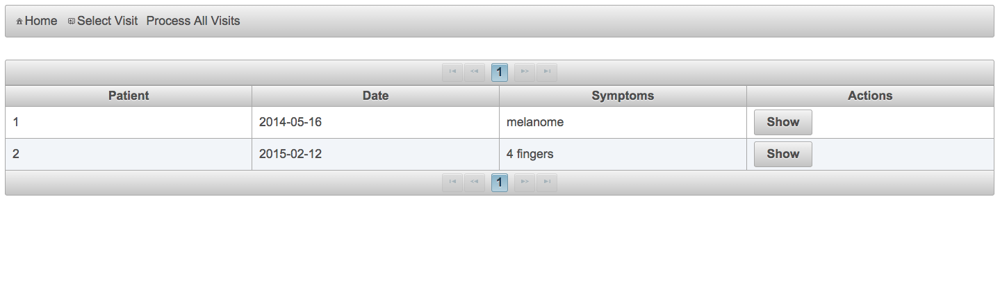
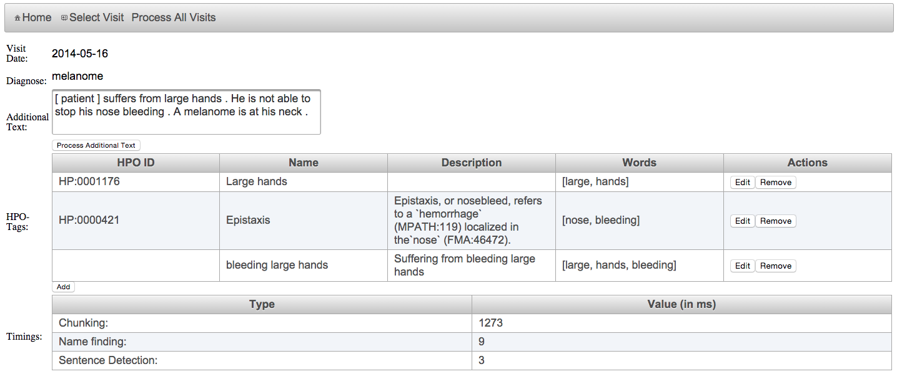
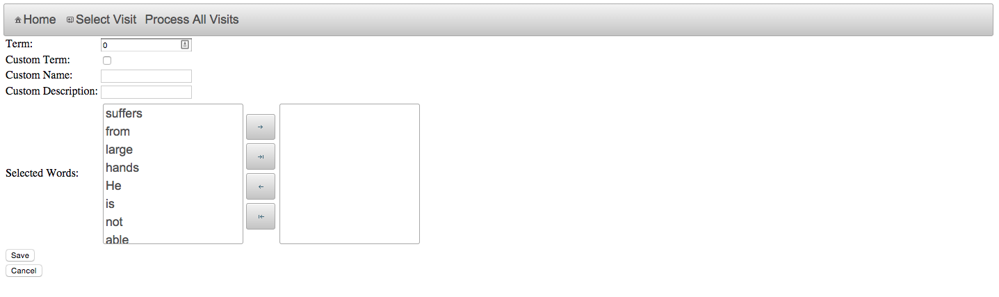
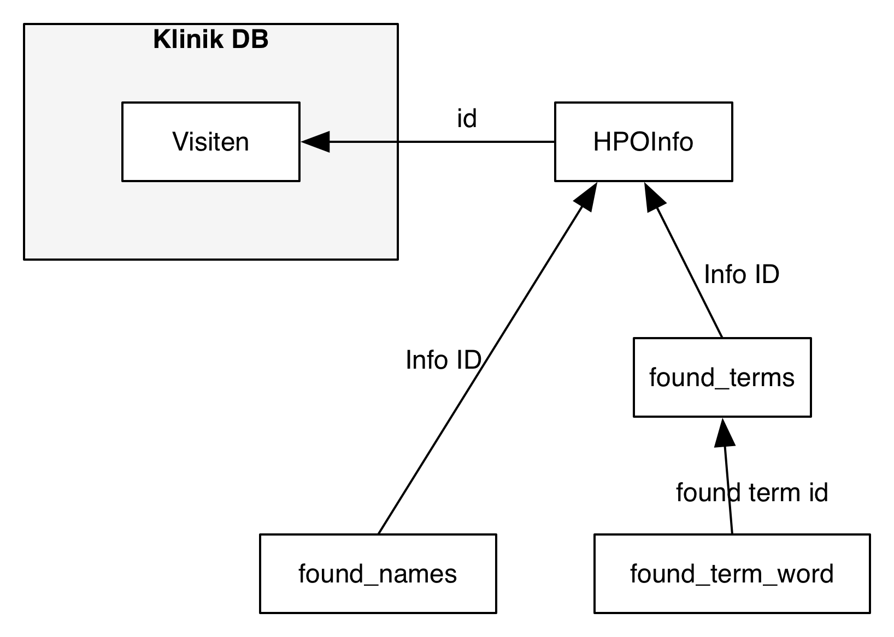

footer: Integration der Human Phenotype Ontology (HPO) in ein medizinisches Forschungsnetz
slidenumbers: true

# Integration der Human Phenotype Ontology (HPO) in ein medizinisches Forschungsnetz
### Lukas Welte

---

# Inhalt
1. Motivation
1. Datenerfassung in der medizinischen Forschung
1. Anforderungen
1. Implementierung
1. Fazit

---

# 1. Motivation
- Standardisierung durch HPO
- Notizen werden gemacht
	→ potentielle Daten
- Kein Reviewprozess der Notizen
	→ Informationsverlust
	
^ Für Maschine nicht lesbar.
Beispiel: Visitendaten und automatische Krankheitsextraktion (phenomizer Charite)

---
# 2. Datenerfassung in der medizinischen Forschung

---

# 2.1 Strukturierte Datenerfassung 
- Schematische Daten
- Je mehr Schema desto mehr Struktur
- Verbessert Wiederverwend- und Maschninenverarbeitbarkeit
- z.B. Relationale Datenbanken, Fragebögen

---

# 2.1.1 Ontologie
- Philosophie: Einteilung des Seienden und der Möglichkeit
- Informatik: Spezifizierung einer Konzeptionalisierung
    - Teilt Entitäten in Begriffe und Relationen
    
---
# 2.1.1 Ontologie - Human Phenotype Ontology
- Phänotypische Abnormalitäten
- Integriert vorhandene Ontologien
- mehr als 11000 Terme
- über 115000 Annotationen

---
# 2.1.2 Natural Language Processing
- Maschinelle Verarbeitung natürlicher Sprache
- Umwandlung von Freitexten in strukturierte Daten

---
# 2.1.2 Natural Language Processing - Funktion
1. Spracherkennung
1. Tokenisierung
1. Morphologische Analyse
1. Syntaktische Analyse
1. Semantische Analyse
1. Dialog und Diskursanalyse

^ Sprach: Übersetzung von physikalisch in digitales (Audio -> Text)

^ Token: Text in Sätze (anhand der Satzzeichen) und Worte segmentiert

^ Morpho: Personalformen und Fälle

^ Syntakt: Strukturelle Funktion -> Subjekt, Objekt, Artikel, etc.

^ Seman: Beudeutung von teilen von oder ganzen Sätzen

^ Dialog: Beziehungen zwischen einzelnen Sätzen

---

# 2.2 Freitext Datenerfassung
- Gegenteil der Strukturierten Datenerfassung
- Einfache Erfassung
- Schwere Auswertung
 
---
# 3. Anforderungen
 
---
# 3. Anforderungen
Annahme:
	- Visiten der Patienten sind vorhanden
	- Visiten enthalten u.a. Symptome und Freitext

---

# 3.1 Visitenbrowser
- Einfacher und schneller Zugriff auf Visiten
- Basisinformationen einer Visite

---

# 3.2 Visiten Detail
- Überblick über gefundene Terme
- Zusatzinformationen zu Termen
- Löschen eines Terms
- Manuelles Ergänzen von Termen

---

# 3.3 Visiten Editor
- Zuordnen von Wörtern zu einem Term
- Erstellen in der HPO nicht vorhandener Terme

---
# 3.4 Daten Auswertung
- Anfallende Daten können ausgewertet werden
- Persistierung in statistisch auswertbarem Format 

---
# 3.5 Deidentifizierung der Daten
- Ersetzen aller Namen durch ```[patient]```
- Erleichtert weitergabe der Texte an Dritte

---
# 3.6 Daten Integrität
- Nur lesender Zugriff auf HPO und Klinik Datenbank
- Ermöglicht Plug and Play Applikation

---
# 4. Implementierung

---
# 4.1 Technologiestack
- JSF
- Glassfish
- MySQL
- OpenNLP

---
# 4.2 Termsuche
1. Filtern von Elementen
1. Gruppierung von Elementen
1. Suche in der HPO
1. Trefferauswertung

---
# 4.2.1 Filtern von Elementen
Heute morgen hatte der Patient starkes Nasenbluten und seine Hand zuckte.

---
# 4.2.1 Filtern von Elementen
~~__Heute morgen hatte__~~ der Patient starkes Nasenbluten ~~__und__~~ seine Hand zuckte.

^ Unnütze Worte wie Konjunktionen werden gestrichen

---
# 4.2.2 Gruppierung von Elementen
- der Patient starkes Nasenbluten 
- seine Hand zuckte

---
# 4.2.3 Suche in der HPO
- seine Hand zuckte
	- seine
	- hand
	- zuckte
	
→ Alle Permutationen

---
# 4.2.4 Trefferauswertung
- Qualität bestimmt durch die Anzahl der Wörter in der Suche, in Relation mit Anzahl der im Term passenden Wörtern

---

# 4.3 Persistierung
- In Programmeigener Datenbank gespeichert
- Ein Datensatz (HPOInfo) je Analysedurchlauf

---

# 4.4 Demo

---
# 4.5 Probleme
- OpenNLP Erkennungs Modelle
- RAM Verbrauch
- OpenNLP Verarbeitungszeit
- Erkennung von Namen
- Datenbank Abfragen

---
# 5. Fazit

---
# 5.1 Ergebnis
- Auswertung bestehender Daten
- Standardisierung der Daten
- HPO könnte schnell weiterentwickelt werden

---
# 5.2 Verbesserungsmöglichkeiten
- Optimierung der Datenbank Abfragen
- Verwendung einer verteilten Datenbank optimiert für die Suche (ElasticSearch)
- Konfigurierbarer gestalten
- Auch ohne UI verwendbar machen

---
# 5.3 Ausblick
- Automatische Diagnoseerstellung aus Freitext
- Präzise Epidemie Auswertung

---
# Vielen Dank für ihre Aufmerksamkeit

---
# Referenzen

[haken.jpg](http://www.apfelpage.de/wp-content/uploads/2012/02/6920F74F-43A6-463D-BBED-6DCE2939C729.jpg)
[ontologiebsp.jpg](http://www.mpg.de/5597076/zoom.jpg)
[freitext.jpg](http://www.wz-newsline.de/polopoly_fs/1.1281451.1364838482!/httpImage/onlineImage.jpg_gen/derivatives/landscape_550/onlineImage.jpg)
[zettelhaufen.jpg](http://blogs.salesforce.com/.a/6a00e54ee3905b8833019aff5190f4970b-pi)